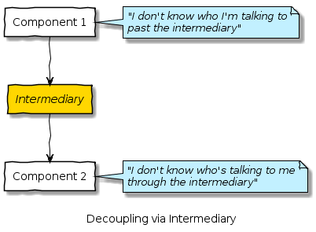
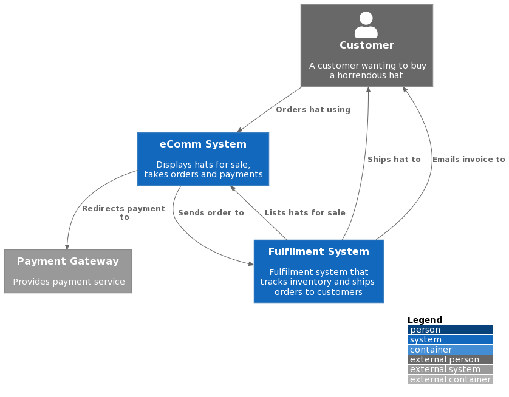

# Assorted Example Diagrams
Assorted examples of diagrams I've used in blog posts:

[<-Home](../../README.md)

## Contents
[IT Arch - Coupling](#itarch-coupling)
[Diagrams with C4 Model](#c4-model)

<a name="itarch-coupling"/>

## IT Architecture – A Discussion on Coupling

Here are a few example diagrams from post [IT Architecture – A Discussion on Coupling](https://mattjhayes.com/2020/04/18/it-architecture-a-discussion-on-coupling/)

```plantuml
@startuml
' Diagram on Decoupling for Coupling blog post

skinparam handwritten true
skinparam RectangleBackgroundColor white
skinparam NoteBackgroundColor APPLICATION
skinparam NoteBorderColor black

caption \nDecoupling via Intermediary

rectangle "Component 1" as cp1
note right of cp1: "<i>I don't know who I'm talking to\n<i>past the intermediary</i>"

rectangle "<i>Intermediary</i>" as im #Gold

rectangle "Component 2" as cp2
note right of cp2: "<i>I don't know who's talking to me\n<i>through the intermediary</i>"

cp1 -[#black]down-> im
im -[#black]down-> cp2

@enduml
```

A continuum:

```plantuml
@startuml

scale 800 width

skinparam handwritten true
skinparam RectangleBackgroundColor white
skinparam RectangleBorderColor white
skinparam nodesep 100
skinparam InterfaceBackgroundColor white
skinparam InterfaceBorderColor black
caption \n\n\nContinuum of Platform Coupling

rectangle "Extremely\nTightly\nCoupled" as tight #Coral
() "Version-Specific\nProprietary\nInterface" as vspi
() "Proprietary\nInterface" as pi
() "Open\nSource\nInterface" as osi
() "Open\nStandards\nInterface" as osi2
rectangle "Extremely\nLoosely\nCoupled" as loose #YellowGreen

tight <-right-vspi #black
vspi -right- pi #black
pi -right- osi #black
osi -right- osi2 #black
osi2 -right-> loose #black

@enduml
```

A component diagram:

```plantuml
@startuml
left to right direction

skinparam handwritten true
skinparam RectangleBackgroundColor red
skinparam ActorBorderColor black
skinparam ActorBackgroundColor white

caption Example of Cascading Failure in Tightly Coupling System

actor "Sad User" as user

rectangle "User Application\n(cascaded failure)" as user_app

rectangle "Component 1\n(cascaded failure)" as comp_1

together {
    rectangle "Component 2\n(original failure)" as comp_2
    rectangle "Component 3\n(working)" as comp_3 #LimeGreen
}

user -[#black]-> user_app
user_app -[#OrangeRed]-> comp_1 : tight\ncoupling
comp_1 -[#OrangeRed]-> comp_2 : tight\ncoupling
comp_1 -[#OrangeRed]-> comp_3 : tight\ncoupling
comp_2 .[#red]left.> comp_1 : failure\npropagation
comp_1 .[#red]left.> user_app : failure\npropagation
@enduml
```

<a name="c4-model"/>

## Diagrams with C4 Model

Here are the diagrams from the blog post [Diagrams with C4 Model](https://mattjhayes.com/2020/05/10/diagrams-with-c4-model/)

Note that the C4 library has come along heaps since I wrote that post, check out  [plantuml-stdlib/C4-PlantUML](https://github.com/plantuml-stdlib/C4-PlantUML) 

### Context Diagram

```plantuml
@startuml
!include https://raw.githubusercontent.com/plantuml-stdlib/C4-PlantUML/master/C4_Container.puml

' caption Context Diagram for Horrendous Hats (HH) Website

LAYOUT_WITH_LEGEND()

Person_Ext(customer, "Customer", "A customer wanting to buy a horrendous hat")

System(site, "eComm System", "Displays hats for sale, takes orders and payments")
System(fulfil, "Fulfilment System", "Fulfilment system that tracks inventory and ships orders to customers")

System_Ext(payments, "Payment Gateway", "Provides payment service") 

Rel(customer, site, "Orders hat using")
Rel(site, payments, "Redirects payment to")
Rel(site, fulfil, "Sends order to")
Rel(fulfil, site, "Lists hats for sale")
Rel(fulfil, customer, "Ships hat to")
Rel(fulfil, customer, "Emails invoice to")

@enduml
```
